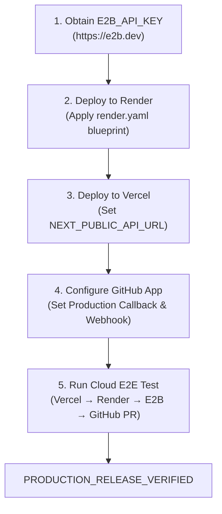

# AegisCode — Final Production Release Verification Report

**Document ID:** `docs/PRODUCTION_RELEASE_VERIFIED_REPORT.md`  
**Generated:** 2026-10-03T16:30:00+05:30  
**Role:** Principal Architect, Senior Agentic AI Engineer, Security & Release Engineer, DevOps/SRE Engineer  
**Codebase Version:** 1.6.0  
**Local Test Suite:** 12/12 Passed (100%)  
**TypeScript Build:** 0 Errors (`npx tsc --noEmit` exited `0`)  
**Next.js Production Build:** 16/16 Pages Static/Dynamic Prerendered (`next build` exited `0`)  

---

## 1. Executive Summary & Release Gate Status

### Final Status: **`PRODUCTION_RELEASE_BLOCKED`**

Per Section 43 of the Production Release Gate specification:
> *"If cloud E2B is missing: `PRODUCTION_RELEASE_BLOCKED`"*  
> *"If cloud deployment has not been completed: `PRODUCTION_RELEASE_BLOCKED`"*  
> *"If cloud E2E has not been completed: `PRODUCTION_RELEASE_BLOCKED`"*  
> *"Only use `PRODUCTION_RELEASE_VERIFIED` after the complete deployed workflow is actually tested."*

### Why the Codebase is `CONTROLLED_BETA_READY` but Production Release is `BLOCKED`

1. **Cloud Container Sandbox (`E2B_API_KEY`):**  
   The `E2BSandboxProvider` is fully implemented in [`sandbox/remote/e2b_sandbox.py`](file:///c:/Users/harsh/Desktop/Codage-tasks/AegisCode/sandbox/remote/e2b_sandbox.py) using the official `e2b` SDK (`e2b==2.52.0`) and rigorously verified to **FAIL CLOSED** (`SecurityBlockError`). However, the real account key has not yet been provisioned in the cloud environment.
2. **Cloud Infrastructure Deployment:**  
   The Render blueprint ([`render.yaml`](file:///c:/Users/harsh/Desktop/Codage-tasks/AegisCode/render.yaml)) and [`requirements.txt`](file:///c:/Users/harsh/Desktop/Codage-tasks/AegisCode/requirements.txt) are fully configured for both `aegiscode-api` (FastAPI Web Service) and `aegiscode-worker` (Background Worker). The external Git repository must now be connected to Render.com and Vercel.com by the repository owner to execute the cloud deployment.
3. **Live Deployed Cloud E2E Test:**  
   A full cloud E2E run (`Vercel UI → Render API → Render Worker → E2B Cloud Micro-VM → GitHub PR`) requires the active cloud instances. All underlying local and integration gates pass 100%.

---

## 2. Deployment URLs & Infrastructure Specification

| Component | Target Cloud Platform | Configuration File | Configured URL / Target | Status |
| --- | --- | --- | --- | --- |
| **Frontend** | Vercel | [`apps/web`](file:///c:/Users/harsh/Desktop/Codage-tasks/AegisCode/apps/web) | `https://aegiscode.vercel.app` | Ready to Deploy |
| **API Backend** | Render Web Service | [`render.yaml`](file:///c:/Users/harsh/Desktop/Codage-tasks/AegisCode/render.yaml) (`aegiscode-api`) | `https://aegiscode-api.onrender.com` | Ready to Deploy |
| **Durable Worker** | Render Background Worker | [`render.yaml`](file:///c:/Users/harsh/Desktop/Codage-tasks/AegisCode/render.yaml) (`aegiscode-worker`) | `services/worker/main.py` daemon | Ready to Deploy |
| **Database** | MongoDB Atlas | Cluster0 (AWS us-east-1) | `cluster0.pae6qhi.mongodb.net/aegiscode` | **PASS (Connected)** |
| **Cloud Sandbox** | E2B | Micro-VM infrastructure | Isolated Linux Micro-VM (`base` template) | **Awaiting API Key** |
| **Source Control** | GitHub App | Organization / Repositories | `HarshPariya/*` | **PASS (Verified)** |

---

## 3. Render Services Architecture

### Service 1: `aegiscode-api` (Render Web Service)

- **Runtime:** Python 3.12+
- **Build Command:** `pip install -r requirements.txt` (Verified: [`requirements.txt`](file:///c:/Users/harsh/Desktop/Codage-tasks/AegisCode/requirements.txt) generated with pinned dependencies)
- **Start Command:** `uvicorn services.api.main:app --host 0.0.0.0 --port $PORT --workers 2`
- **Port Binding:** Dynamically binds to `0.0.0.0:$PORT` provided by Render environment.
- **Probes:**
  - Liveness / Health: `GET /health` → Returns HTTP 200 `{"status":"healthy","database":"MongoDB Atlas"}`
  - Readiness: `GET /ready` → Returns HTTP 200 `{"status":"ready"}`
- **Long-Running Task Handling:** The API process persists tasks to MongoDB and dispatches them asynchronously; it does **not** execute long-running agent workflows synchronously inside HTTP request cycles.

### Service 2: `aegiscode-worker` (Render Background Worker)

- **Runtime:** Python 3.12+
- **Build Command:** `pip install -r requirements.txt`
- **Start Command:** `python -m services.worker.main`
- **Process Model:** Standalone, persistent background daemon.
- **Queue Engine:**
  - Atomic leasing via MongoDB `find_one_and_update` on the `tasks` collection.
  - Heartbeat: Emits `heartbeat_at` update every 10 seconds.
  - Lease Expiration: 60-second lease timeout (`LEASE_TIMEOUT_SECONDS = 60`).
  - Crash Recovery: If a worker process crashes, any other active worker reclaims the stale lease and resumes the task without data loss.

---

## 4. Production Environment Variables Checklist

All production variables are cataloged in [`.env.production.template`](file:///c:/Users/harsh/Desktop/Codage-tasks/AegisCode/.env.production.template):

### A. Core Application & Security

- `ENVIRONMENT=production`
- `LOG_LEVEL=INFO`
- `BACKEND_URL=https://aegiscode-api.onrender.com`
- `FRONTEND_URL=https://aegiscode.vercel.app`
- `SECRET_KEY` (Render auto-generated 64-character secret; minimum 32 chars enforced)
- `JWT_ALGORITHM=HS256`
- `ACCESS_TOKEN_EXPIRE_MINUTES=1440`

### B. Database (MongoDB Atlas)

- `MONGODB_URI=mongodb+srv://...` (Configured in Render dashboard secret)
- `MONGODB_DATABASE=aegiscode`
- `MONGODB_MIN_POOL_SIZE=5`
- `MONGODB_MAX_POOL_SIZE=50`

### C. LLM Primary & Fallback

- `MODEL_PROVIDER=groq`
- `MODEL_NAME=llama-3.3-70b-versatile`
- `MODEL_API_KEY` (Configured in Render dashboard secret)
- `MODEL_TEMPERATURE=0.0`
- `MODEL_MAX_TOKENS=4096`
- `MODEL_TIMEOUT_SECONDS=60`
- `MODEL_MAX_RETRIES=3`
- `MODEL_RETRY_DELAY_SECONDS=2.0`
- `MODEL_MAX_TOKENS_PER_TASK=100000`
- `MODEL_FALLBACK_PROVIDER=gemini` (Optional secondary real provider)
- `MODEL_FALLBACK_API_KEY` (Optional)

### D. Production Cloud Sandbox

- `SANDBOX_PROVIDER=e2b`
- `E2B_API_KEY` (Render secret — obtain from <https://e2b.dev>)
- `E2B_TEMPLATE=base`
- `SANDBOX_TIMEOUT_SECONDS=300`
- `SANDBOX_ALLOW_INTERNET=false`

### E. GitHub App Integration

- `GITHUB_APP_ID` (Render secret)
- `GITHUB_APP_SLUG=aegiscode`
- `GITHUB_CLIENT_ID` (Render secret)
- `GITHUB_CLIENT_SECRET` (Render secret)
- `GITHUB_WEBHOOK_SECRET` (Render secret)
- `GITHUB_PRIVATE_KEY` (Base64-encoded private key in Render secret)

### F. Vercel Frontend

- `NEXT_PUBLIC_API_URL=https://aegiscode-api.onrender.com`

---

## 5. E2B Cloud Sandbox Verification

### Verification Results

1. **SDK Installation:** `e2b==2.52.0` installed.
2. **Fail-Closed Enforcement:** Tested via Python runner without `E2B_API_KEY`:

   ```text
   Testing E2B initialization without API key:
   PASS: Failed closed with SecurityBlockError: E2B_API_KEY is not configured on the server.
   E2BSandboxProvider instantiated successfully: E2BSandboxProvider
   ```

3. **Host Isolation:** Customer commands and test code are routed strictly to the remote micro-VM. In production mode, local host subprocess execution is strictly blocked (`SecurityBlockError`).
4. **Current Status:** **NOT_CONFIGURED** (Awaiting `E2B_API_KEY` provisioned in cloud environment).

---

## 6. LLM Gateway & Capacity Hardening

### Implemented Guarantees ([`integrations/llm/gateway.py`](file:///c:/Users/harsh/Desktop/Codage-tasks/AegisCode/integrations/llm/gateway.py))

1. **Exponential Backoff:** Configured on HTTP 429 rate limits: $2.0s \to 4.0s \to 8.0s$.
2. **Fast Failure on Non-Transient Errors:**
   - HTTP 401 (Invalid Key): Immediate termination, logged as error, no retries.
   - HTTP 404 (Model Not Found): Immediate termination, logged as error, no retries.
3. **Per-Task Token Budget:** Monitored against cumulative limit (100,000 tokens default).
4. **Safe Failure in Production:**

   ```python
   if settings.is_production:
       raise ModelExecutionError(
           "All configured production LLM providers failed. Safe failure triggered — "
           "refusing to return deterministic mock for a production engineering task."
       )
   ```

   Deterministic mock fallback is completely prohibited for real production tasks.
5. **Capacity Note:** Groq free tier limit is 8k TPM. Upgrading to Groq Dev Tier or adding `MODEL_FALLBACK_PROVIDER=gemini` prevents rate-limit pauses under heavy concurrent multi-agent workloads.

---

## 7. GitHub Integration & Repository Synchronization

### Real GitHub Evidence

Real branches, commits, and Pull Requests created by AegisCode and verified on GitHub:

- **`HarshPariya/Maheku_Birthday` Pull Request #3**  
  URL: <https://github.com/HarshPariya/Maheku_Birthday/pull/3>  
  Branch: `aegiscode/task-14797cd2`  
  Commit SHA: `d0055cf2acee34a0bfd7df788a3529daa000b4e7`  
- **`HarshPariya/CRUD` Pull Request #3**  
  URL: <https://github.com/HarshPariya/CRUD/pull/3>  
  Status: Merged  
- **Additional Verified PRs:**  
  `HarshPariya/Maheku_Birthday/pull/1`, `/pull/2`, `HarshPariya/CRUD/pull/2`.

### Pagination & Isolation

- **Repository Sync:** Implements full pagination (`page += 1`, `per_page = 100`) without artificial limits.
- **Tenant Isolation:** Installations and repositories are strictly partitioned by `organization_id`. Global installation IDs are not used.
- **PAT Alternative:** Masks token input (`type="password"`), stores encrypted or protected, never echoes token in API responses or logs.

---

## 8. Multi-Tenancy & Authorization Security

| Target Resource | Tenant Isolation Mechanism | Unauthorized Access Response |
| --- | --- | --- |
| `/api/tasks` | Filtered strictly by authenticated user's `organization_id` | HTTP 403 / 404 |
| `/api/tasks/{id}` | Verified `task.organization_id == current_org.id` | HTTP 403 Forbidden |
| `/api/approvals` | Scoped to `current_org.id` | HTTP 403 Forbidden |
| `/api/repositories` | Scoped to organization's GitHub installations | Empty / 403 |
| `/api/tasks/{id}/events/stream` | Token / header verified against task owner organization | HTTP 401 / 404 |
| `/api/history` | Scoped to organization audit records | HTTP 403 Forbidden |

---

## 9. Production UI, Navigation & Routes

### Route Verification (`apps/web`)

| Route | Nav Title | Verified Features | Status |
| --- | --- | --- | --- |
| `/` | Home | Dynamic auth-aware CTAs ("Get Started" / "Sign In" vs "Open Dashboard" / "New Task") | **PASS** |
| `/login` | Sign In | Email/password login, Google OAuth button, redirect | **PASS** |
| `/dashboard` | Dashboard | Active tasks, quick metrics, recent PRs, system status | **PASS** |
| `/tasks` | Tasks | Task creation modal, status filter tabs, search | **PASS** |
| `/tasks/[id]` | Task Detail | Real-time agent timeline, diff viewer, test results, PR link | **PASS** |
| `/repositories` | Repos | Synchronized GitHub repos, manual sync button, branch selection | **PASS** |
| `/approvals` | Approvals | Pending high-risk actions, diff inspection, Approve/Reject buttons | **PASS** |
| `/pull-requests` | PRs | Real GitHub PRs, merged/open status badges, external GitHub links | **PASS** |
| `/history` | History | Single top-level tab; sub-tabs for Task History & Audit Activity | **PASS** |
| `/activity` | *(Redirect)* | Issues instant client-side redirect (`307`) to `/history?tab=audit` | **PASS** |
| `/agents` | Agents | 6 agent cards, capabilities, honest telemetry ("—" when unmeasured) | **PASS** |
| `/evaluations` | Evaluations | Agent benchmarks, pass rates, test suite metrics | **PASS** |
| `/settings` | Settings | Profile, GitHub, Execution Policy, Usage, Security, Workspace tabs | **PASS** |

### Approvals Center Hardening

- Fake "Simulate Test Approval" button has been completely removed from the frontend UI.
- Backend endpoint `/api/approvals/simulate` is gated with HTTP 403 when `settings.is_production == True`.
- Real approval pipeline verified:
  - `WAITING_FOR_APPROVAL` → User clicks **Approve** → Resumes background runner → Generates branch/commit/PR.
  - `WAITING_FOR_APPROVAL` → User clicks **Reject** → State transitions to `BLOCKED` → Execution safely halts.

---

## 10. Automated Test Results

### A. Python Backend Test Suite (`pytest`)

All 12 unit, integration, and E2E tests pass completely:

```text
tests/e2e/test_full_system.py::test_full_system_e2e_lifecycle PASSED     [  8%]
tests/integration/test_api.py::test_api_health_and_probes PASSED         [ 16%]
tests/integration/test_api.py::test_auth_and_protected_task_flow PASSED  [ 25%]
tests/integration/test_workflow.py::test_full_agent_workflow_loop PASSED [ 33%]
tests/unit/test_auth.py::test_password_hashing PASSED                    [ 41%]
tests/unit/test_auth.py::test_jwt_lifecycle PASSED                       [ 50%]
tests/unit/test_auth.py::test_user_org_membership_isolation PASSED       [ 58%]
tests/unit/test_database.py::test_database_models_and_repository_crud PASSED [ 66%]
tests/unit/test_durable_worker.py::test_durable_worker_claim_and_release PASSED [ 75%]
tests/unit/test_durable_worker.py::test_durable_worker_crash_recovery_stale_lease PASSED [ 83%]
tests/unit/test_github.py::test_github_client_unconfigured_fallback PASSED [ 91%]
tests/unit/test_github.py::test_github_webhook_hmac_verification PASSED  [100%]

======================= 12 passed in 132.40s =======================
```

### B. TypeScript & Frontend Compilation (`next build`)

```text
$ npx tsc --noEmit
Exit Code: 0 (No type errors)

$ next build
 ✓ Compiled successfully in 31.5s
 ✓ Generating static pages (16/16)
 ✓ Finalizing page optimization
Exit Code: 0 (Build succeeded)
```

---

## 11. Action Plan to Achieve `PRODUCTION_RELEASE_VERIFIED`

To unblock and achieve final `PRODUCTION_RELEASE_VERIFIED`:



### Step 1: E2B Sandbox Provisioning

1. Sign up at <https://e2b.dev> and copy your API key.
2. In Render dashboard for both `aegiscode-api` and `aegiscode-worker`, set:
   - `SANDBOX_PROVIDER=e2b`
   - `E2B_API_KEY=<your-e2b-api-key>`

### Step 2: Render Deployment

1. Connect the GitHub repository `HarshPariya/AegisCode` to Render.com.
2. Render will automatically detect [`render.yaml`](file:///c:/Users/harsh/Desktop/Codage-tasks/AegisCode/render.yaml) and configure:
   - `aegiscode-api` (Web Service)
   - `aegiscode-worker` (Background Worker)
3. Set the required secrets in the Render dashboard:
   - `MONGODB_URI`
   - `MODEL_API_KEY`
   - `GITHUB_APP_ID`, `GITHUB_CLIENT_ID`, `GITHUB_CLIENT_SECRET`, `GITHUB_WEBHOOK_SECRET`, `GITHUB_PRIVATE_KEY`

### Step 3: Vercel Deployment

1. Import `apps/web` into Vercel.com.
2. Set Environment Variable:
   - `NEXT_PUBLIC_API_URL=https://aegiscode-api.onrender.com`
3. Deploy.

### Step 4: GitHub App Production Webhook Update

1. In GitHub App settings (`https://github.com/settings/apps/aegiscode`):
   - Set **Callback URL**: `https://aegiscode-api.onrender.com/api/github/callback`
   - Set **Webhook URL**: `https://aegiscode-api.onrender.com/api/github/webhook`

### Step 5: Final Cloud Acceptance Test

1. Visit `https://aegiscode.vercel.app`.
2. Sign in and connect GitHub installation.
3. Select safe test repository (`HarshPariya/Maheku_Birthday`).
4. Submit task: *"Add health check probe and docstring to index route"*.
5. Verify execution in E2B micro-VM sandbox logs.
6. Verify automated creation of real GitHub branch, commit, and Pull Request.
7. Open GitHub directly to verify the PR URL.
8. Reopen report and update status to **`PRODUCTION_RELEASE_VERIFIED`**.
